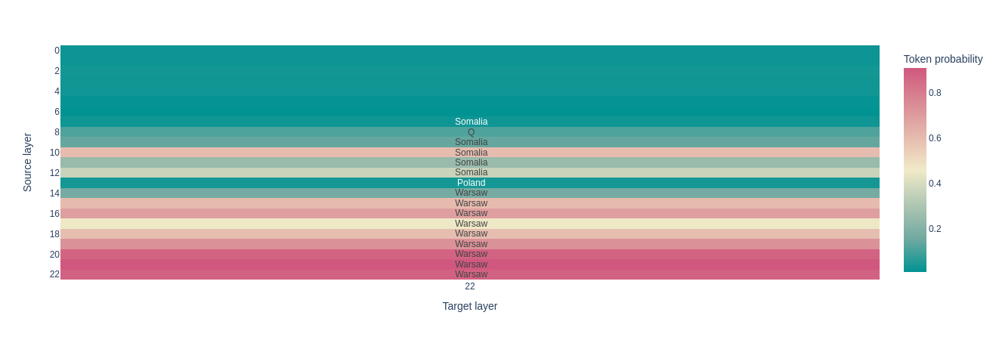

# 🩺 Patchscopes: A Unifying Framework for Inspecting Hidden Representations of Language Models

Re-implementation of the [Patchscopes](https://pair-code.github.io/interpretability/patchscopes/) paper ([arXiv:2401.06102](https://arxiv.org/abs/2401.06102), [official implementation](https://github.com/PAIR-code/interpretability/tree/master/patchscopes/code)).

### Overview

Patchscopes is a tool for inspecting hidden representations of transformer models.

For decoding what is encoded in a given representation (for instance, the ```CEO``` token in the figure under) activations from a source prompt (```Amazon's forer CEO attended Oscars```) are patched in a target prompt(```cat->cat; 135->135; hello->hello; ?```). The target prompt is designed with few-shot examples of token repetitions to encourage decoding the token identity given a hidden representation.


<p align="center">
    
</p>


### Demo

See ```attribute_extraction.ipynb``` for a demo on how to run the code.

**Source prompt:** ```Amazon's former CEO attended Oscars```\
**Source token:** ```CEO```\
**Target prompt:** ```cat->cat; 135->135; hello->hello; ?->```


#### gpt2-small


### Reproduction of Experiments From *Language Models Implement Simple Word2Vec-style Vector Arithmetic*

[Language Models Implement Simple Word2Vec-style Vector Arithmetic](https://arxiv.org/abs/2305.16130) study the mechanisms through which LLMs recall information (see Figure 7). 

**Abstractive tasks** involve recalling a token that does *not* appear in the context, such as in:
```Q: What is the capital of Somalia?
A: Mogadishu
Q: What is the capital of Poland?
A:
``` 
The authors provide evidence that transformers recall tokens that do *not* appear in the context through 3 stages of processing:
1. **Argument Formation (A)**: the model represents the argument to the desired relation in the residual stream (the ‘*Poland’* in *get_capital(Poland)*) - Layers 9-17
2. **Function Application (B)**: the model switches from the argument to the output of the function (the ‘*Warsaw*’ in *Warsaw= get_capital(Poland)*) - Layer 18
3. **Saturation (C)**: the model recognizes it has solved the next token and ceases updating the representation - Layers 19-22

Here on gpt2-medium:


**Extractive tasks**, on the contrary, require finding a token that *does* appear in context, such as in:
```The capital of Somalia is Mogadishu.
The capital of Poland is Warsaw.
Q: What is the capital of Somalia?
A: Mogadishu
Q: What is the capital of Poland?
A:
```
The extractive tasks immediately saturates.

Here on gpt2-medium:



