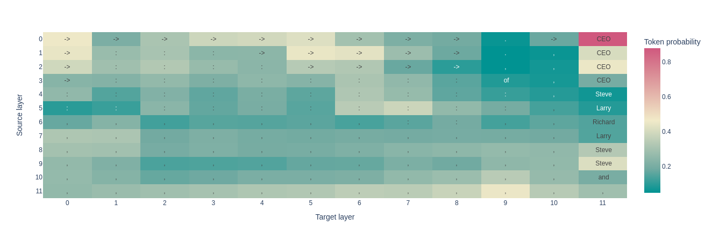

# 🩺 Patchscopes: A Unifying Framework for Inspecting Hidden Representations of Language Models

Re-implementation of the [Patchscopes](https://pair-code.github.io/interpretability/patchscopes/) paper ([arXiv:2401.06102](https://arxiv.org/abs/2401.06102), [official implementation](https://github.com/PAIR-code/interpretability/tree/master/patchscopes/code)).

### Overview

Patchscopes is a tool for inspecting hidden representations of transformer models.

For decoding what is encoded in a given representation (for instance, the 'CEO' token in the figure under) activations from a source prompt ("Amazon's forer CEO attended Oscars") are patched in a target prompt("cat->cat; 135->135; hello->hello; ?"). The target prompt is designed with few-shot examples of token repetitions to encourage decoding the token identity given a hidden representation.


<p align="center">
    
</p>


### Demo

**Source prompt:** ```Amazon's former CEO attended Oscars```\
**Source token:** ```CEO```\
**Target prompt:** ```cat->cat; 135->135; hello->hello; ?->```


#### gpt2-small

